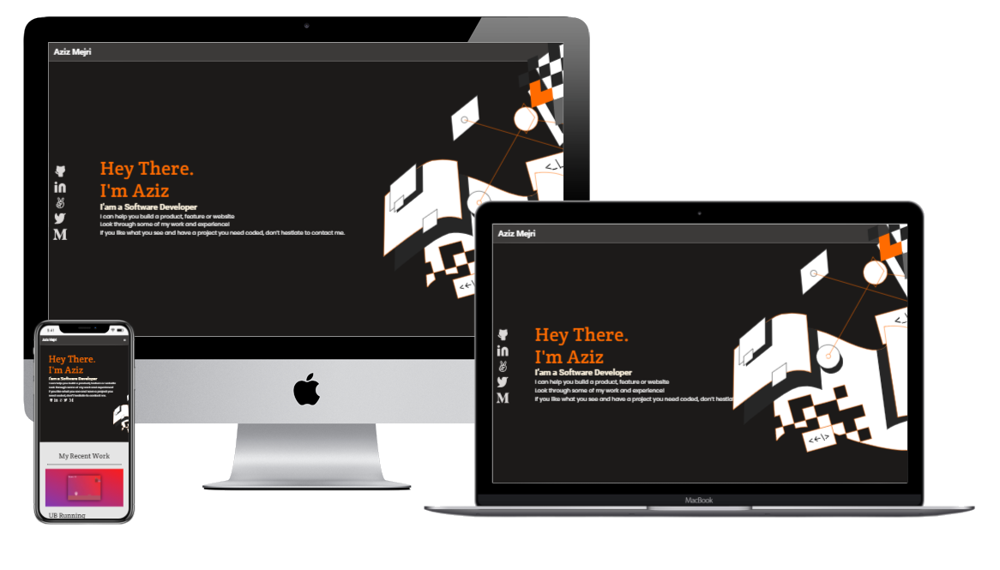

   

# Mobile-menu-CR-review

>This project purpose is to mock the implementation of the mobile menu for the microverse's small-portfolio project using recently acquired JavaScript knowledge for CR trials.

## Built With

- **HTML/CSS and JS best practices:** Correct use of tags, elements, properties and syntax.
- **GitHub flow:**  Correct use of Branches for deployment and features development.

# Preview 👁️

## Authors

👤 Karla Delgado

- GitHub: [@githubhandle](https://github.com/karlavdelgadof)
- Twitter: [@twitterhandle](https://twitter.com/karlavdelgadof)
- LinkedIn: [LinkedIn](https://www.linkedin.com/in/karla-delgado-613a32239/)

## Show your support

Give a ⭐️ if you like this project!

## Acknowledgments

- Microverse-Student-Project-1 Figma Templates

## 📝 License

This project is [MIT](./MIT.md) licensed.
